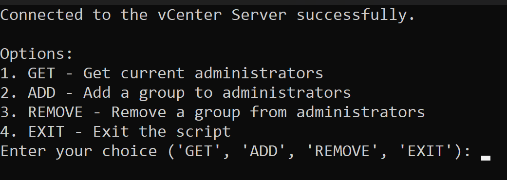
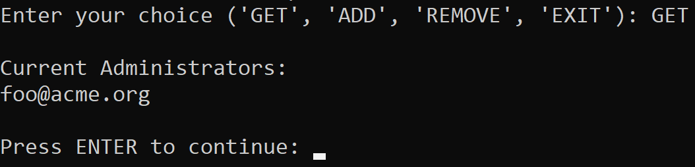
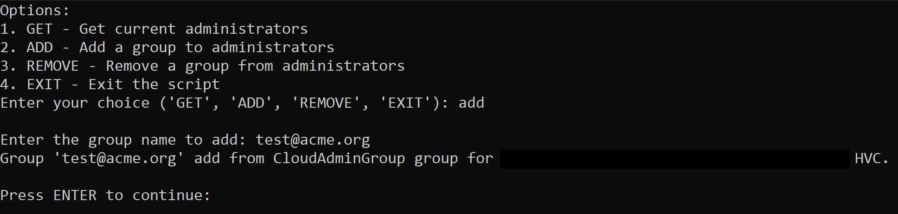
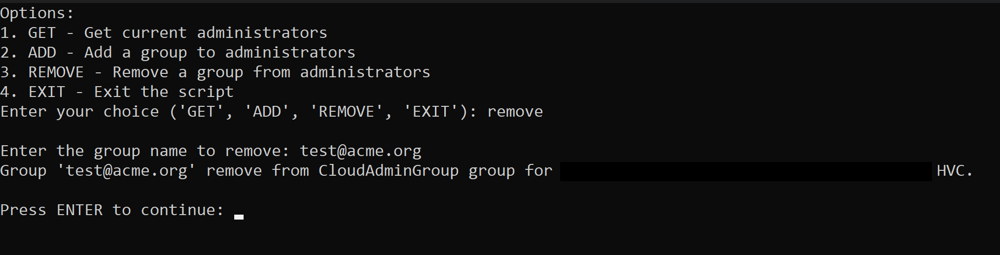

# PowerCLI-Scripts

A repository of useful PowerCLI-related Scripts, aimed at vSphere Administrators, with a special focus on VMware Cloud implementations of vSphere.
**The scripts contained within this repository come with zero support by VMware Global Support. Use at your own risk, or use as a reference on how to automate similar tasks.**
## Prerequisites

 - Make sure the [latest PowerCLI Version](https://developer.vmware.com/docs/15353/powercli-change-log/) is installed on your local machine
 - Clone this Git Repo to your local machine `gh repo clone Loafabreadly/PowerCLI-Scripts`

## Scripts & Usage
 - `/CloudAdminGroup-Manage.ps1`
	 - Input: vCenter FQDN, Password
	 - Usage: `.\CloudAdminGroup-Manage.ps1`
	 - Results: A repeating options list will display, allowing users to Get, Add, or Remove AD Users/Groups from the CloudAdminGroup for a given VMC vCenter
	 - 
	 - 
	 - 
	 - 
 - `/Get-VMCSDDCDetails.ps1`
	 - Input: [CSP API Token](https://developer.vmware.com/apis/csp/csp-iam/latest/) with permissions to the VMC SaaS Application
	 - Usage: `.\Get-VMCSDDCDetails.ps1`
	 - Results: Outputs SDDC-level and combined ORG-level SDDC details such as Region, Linked AWS Account, Deployment Type, Host Count, and Cluster Count
 - `/ManageEDRSPolicy.ps1`
	 - Input: [CSP API Token](https://developer.vmware.com/apis/csp/csp-iam/latest/) with permissions to the VMC SaaS Application
	 - Usage: `.\ManageEDRSPolicy.ps1`
	 - Results: Users can view/modify the EDRS policy on a per-Cluster per-SDDC basis
 - `/Networking/NetAdapter-VacateNetwork.ps1`
	 - Input: vCenter FQDN, Password, Source Network to Vacate, Target Network to move VMs to
	 - Usage: `.\NetAdapter-VacateNetwork.ps1`
	 - Results: Moves all VMs connected to the Source Network over to the Target Network
 - `\GetVM-Details.ps1`
	 - Input: vCenter FQDN, Password, VM Name
	 - Usage: `.\GetVM-Details.ps1`
	 - Results: Outputs the Name, PowerState, NumCpu, MemoryGB, & vCenter Folder for the given VM.

